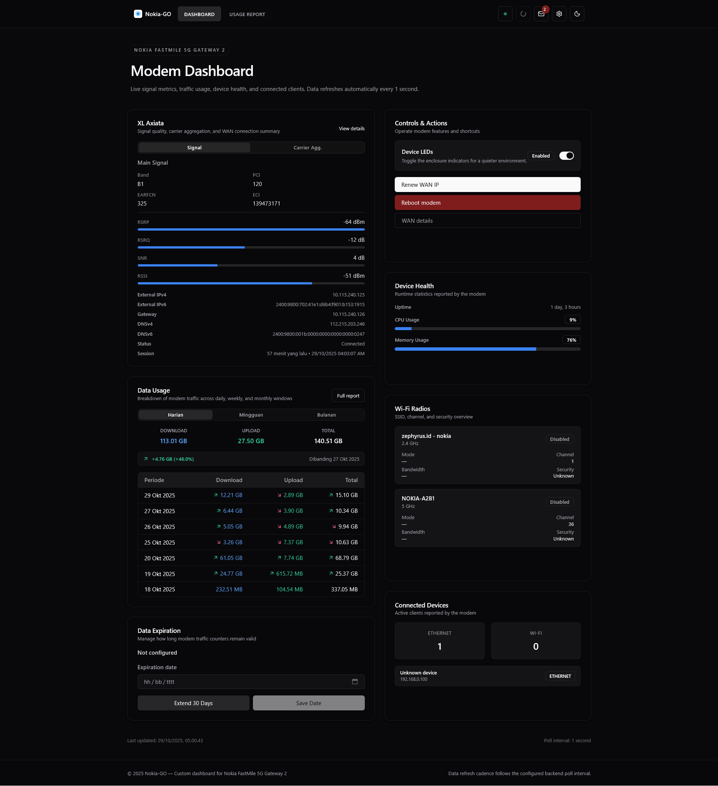

# Nokia Router Dashboard (Go)

> [!note]
> _Do something. If it doesn't work, do something else. No idea is too crazy._</br>
**Jim Hightower**, _The New York Times, March 9, 1986_.

## Preview



## Features

- Full web dashboard pulling live LTE signal, service carrier-aggregation data, device uptime, CPU, memory, router/WAN IP and DNS information.
- Daily traffic usage visualisation with automatic aggregation and chart tooltips for the last seven days.
- Connected device inventory showing LAN/Wi-Fi counts, per-device metadata, and alias resolution from router configuration.
- Wi-Fi status panels for 2.4 GHz and 5 GHz networks that reflect enablement state and SSID details.
- SMS inbox viewer with unread badge, inline message viewer, and mark-as-read support via router API.
- LED control switch, enabling/disabling indicators with optimistic UI feedback.
- Data expiration manager that reads, extends (30 days), or saves custom expiry timestamps directly on the router.
- WAN IP renewal workflow that cycles APN profiles until a new public IP is observed, complete with progress/error toasts.
- Router reboot command exposed in the dashboard with non-blocking notifications tracking success or failure.
- In-browser configuration editor with live validation, toast notifications, and automatic service reload on save.
- Configuration writes persist to `config.json`; the server hot-reloads listener host/port without restarts and mirrors CLI overrides (flags/env vars).

## API Endpoints

- `GET /api/daily_usage` — aggregated traffic history, totals, and last-seven-day breakdown used by the dashboard charts.
- `GET /api/get_data_expired` — returns the currently stored data-expiration timestamp.
- `GET /api/set_data_expired?data_expired=<unix>` — updates the data-expiration timestamp (query parameter required).
- `GET /api/prelogin_status` — lightweight status snapshot available without an authenticated router session.
- `GET /api/overview` — high-level router statistics (requires authenticated session).
- `GET /api/wan_status` — WAN connection metrics, including external IP and DNS servers.
- `GET /api/device_status` — CPU, memory, and uptime statistics.
- `GET /api/service_data` — LTE carrier-aggregation and service health info.
- `GET /api/status_web` — detailed LTE signal data; also refreshes local usage counters.
- `GET /api/set_apn?apn=<profile>` — switches the router APN to the provided profile name.
- `GET /api/wlan_configs_24g` — 2.4 GHz WLAN configuration and enablement flags.
- `GET /api/wlan_configs_5g` — 5 GHz WLAN configuration and enablement flags.
- `GET /api/do_reboot` — issues a reboot command to the router.
- `GET /api/lan_status` — LAN device inventory with alias metadata.
- `GET /api/sms` — SMS inbox payload from the router.
- `GET /api/set_sms_state?smsid=<id>&smsunread=<0|1>` — toggles SMS read/unread state.
- `GET /api/cell_identification` — cellular identity information (band, PCI, EARFCN, etc.).
- `GET /api/led_status` — normalized LED enablement flags (`enabled`, `status_led`, `signal_led`).
- `GET /api/led_state` — same normalized LED payload (read-only compatibility).
- `POST /api/led_state` — enables or disables LEDs (`{"enable":true}` or `?enable=false`).
- `GET /api/config/listener_available?host=&port=` — validates prospective listener host/port before saving config.
- `GET /api/config` — returns the current merged configuration snapshot.
- `POST /api/config` — persists configuration changes and triggers a hot reload.

## Configuration

- Copy `config.example.json` to `config.json` and adjust values.
- Command line flag `-config` selects alternate file.
- Environment variables (`ROUTER_HOSTNAME`, `ROUTER_USERNAME`, `ROUTER_PASSWORD`, `HOST`, `PORT`) override config fields.
- Defaults applied if still unspecified: host `192.168.0.1`, user `admin`, password `6fa6e262c3`, listen `0.0.0.0:5000`.

## Build

Manual

```sh
CGO_ENABLED=0 GOOS=linux GOARCH=amd64 go build -o bin/nokia ./cmd/server
```

Using the provided Makefile (outputs live in `dist/`):

```sh
make linux                      # build both amd64 + arm64
make linux VERSION=v1.0.1       # build with custom version tag
make linux-amd64 VERSION=v1.0.1 # single target
make clean                      # remove dist/
```

If `upx` is on your PATH, binaries are compressed automatically (fallback is to skip compression).
`make` injects git metadata automatically, so binaries print `nokia-VERSION-HASH` (and `-dirty` if the worktree has changes).
Run:

```sh
./bin/nokia setup [-config path]   # generate config then exit
./bin/nokia run   [-config path]   # start web server
./bin/nokia version                # show version
```

## Initial CLI Setup

If you build/run the project manually:

```sh
# writes ~/.config/nokia/config.json with defaults path
./bin/nokia setup
# start using the generated config
./bin/nokia run
# Setup with custom config path
./bin/nokia setup -config /etc/nokia/config.json
# Start using the generated custom config path
./bin/nokia run -config /etc/nokia/config.json
# Inspect version info
./bin/nokia version
```

### Configuration Flow

The application merges configuration from multiple sources in this order:

1. **Defaults** (see `internal/config/config.go`) seed sensible values for router address, credentials, and HTTP listen address.
2. **File**: the JSON at the resolved config path (defaults to `${HOME}/.config/nokia/config.json`, overridable via `-config` flag) overwrites the defaults.
3. **Environment variables**: the following keys take precedence over file values when set (whitespace is trimmed):
   - `ROUTER_HOSTNAME`
   - `ROUTER_USERNAME`
   - `ROUTER_PASSWORD`
   - `HOST` (HTTP listen address)
   - `PORT` (HTTP listen port)
4. **Fallback cleanup**: after merge we ensure every field is populated—if any value ends up blank it is replaced by the default again.
Running `setup` simply ensures the config file exists by materialising the defaults on disk (without overriding existing values). Subsequent edits—either manual or via the web UI—will be picked up the next time you invoke `run`, and the UI hot-reloads the service after each save.

> [!tip]
> After the daemon starts you can manage configuration from the web UI by visiting `http://<LISTEN_HOST>:<LISTEN_PORT>` (defaults to `http://127.0.0.1:5000` on the CLI or `http://<router-ip>:5000` on OpenWrt). Saving changes in the UI writes to the config file and automatically restarts the service. If you change either `ListenHost` or `ListenPort`, reconnect using the new address.

## Service Integration

- An OpenWrt init script template lives in `services/nokia`. Update the binary path if you install the service under a different location, then copy it to `/etc/init.d/nokia`, `chmod 755`, and run:

  ```sh
  /etc/init.d/nokia enable
  /etc/init.d/nokia start
  ```

- The script respects `$HOME` so config defaults to `${HOME}/.config/nokia/config.json` on OpenWrt as well.

## OpenWrt Packages

- CI publishes `.ipk` artifacts for OpenWrt v23.05.5 (`aarch64_generic`) to <https://repo.najahi.dev/pkg/nokia-go/>.
- To track the feed directly from your router:

  ```sh
  echo "src/gz nokia https://repo.najahi.dev/pkg/nokia-go/aarch64_generic" \
    | tee /etc/opkg/customfeeds.conf
  opkg update
  opkg install luci-app-nokia-go
  ```

- After installation the binary is placed at `/usr/sbin/nokia` and managed via `/etc/init.d/nokia`.

### Running the Service

```sh
# start automatically on boot
/etc/init.d/nokia enable
# launch the daemon now with default config file ~/.config/nokia/config.json
/etc/init.d/nokia start
# You can also restart/stop when needed
/etc/init.d/nokia restart
/etc/init.d/nokia stop
```

> [!tip]
> The OpenWrt init script runs the daemon as `nokia run --config /root/.config/nokia/config.json`. If that file is missing, the binary will generate it automatically (same behaviour as the CLI `setup` command) before binding the HTTP server.</br>
> Once it is up, browse to `http://<router-ip>:5000` to tweak settings via the web UI.</br>
> Remember to update the URL whenever you change the listener.

## License

This project is licensed under the [Apache License](LICENSE), Version 2.0.

See [NOTICE](NOTICE) for attribution details.
